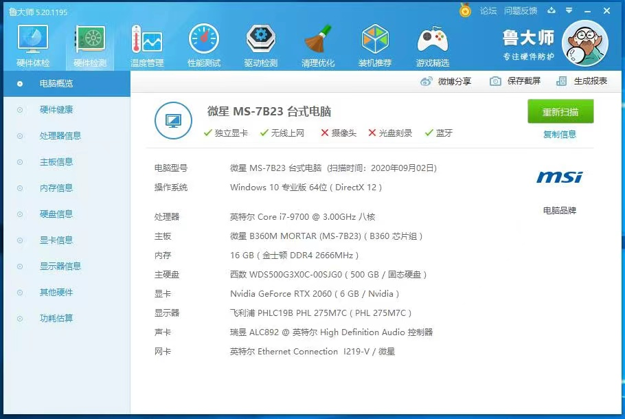
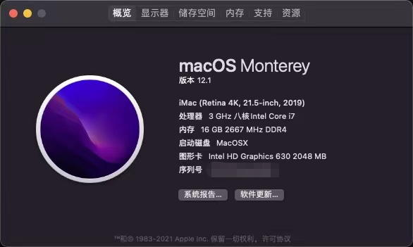

# MSI-B360M-i7-9700-OC-EFI
微星B360M-i7 9700核显黑苹果OC引导

- EFI引导使用的OC(无主题)
- 我的显卡是RTX 2060，固使用核显
- 显示器接口使用DP接口
- 硬盘使用金士顿240G SATA固态硬盘
- 网络使用有线网络
- 蓝牙，WIFI不可用
- 声音我用的USB耳罩耳机，自带声卡，耳机孔没试过
- 系统是黑果小兵下载的【macOS Monterey 12.1 21C52 Installer for OpenCore 0.7.6 and CLOVER 5143 and WEPE 三 EFI 分区原版镜像】

### 我的电脑配置图

### 黑苹果效果图
